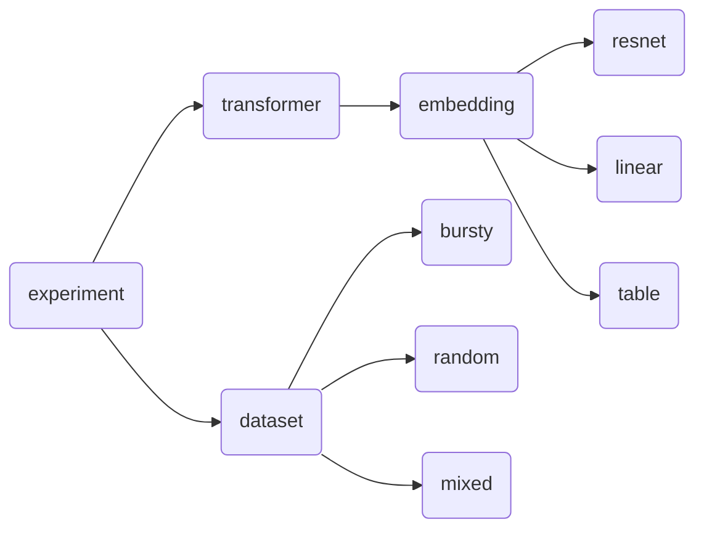

# In-Context Learning Experiments
This repository contains experiments to evaluate when transformers exhibit in-context learning (ICL) capabilities, and how expressive ICL is. Repo contains a pytorch implementation of the experiments described in DeepMind's [emergent_in_context_learning](https://github.com/google-deepmind/emergent_in_context_learning/) repository (link to their [paper](https://proceedings.neurips.cc/paper_files/paper/2022/file/77c6ccacfd9962e2307fc64680fc5ace-Paper-Conference.pdf)).

## About ICL

Given a function class $\mathcal{H}$ with distribution $\mathcal{D}_{\mathcal{H}}$ and data space $\mathcal{X}$ with distribution $\mathcal{D}_{\mathcal{X}}$, in-context learning describes the process of learning to predict $h(x_{query})$ given the prompt
$$ S=(x_1, h(x_1), x_2, h(x_2), ..., x_n, h(x_n), x_{query}) $$where $h \sim \mathcal{D}_{\mathcal{H}}$, and $x_1, ..., x_n, x_{query} \sim \mathcal{D}_{\mathcal{X}}$.

A model $f$ in-context learns the function class $\mathcal{H}$ up to $\epsilon$ if the population loss
$$ \mathbb{E}_{x_i, x_query, h}\left[(f(S)-h(x_{query}))^2\right] \leq \epsilon $$ for large enough $n$ (from [Garg et al. 2022](https://arxiv.org/pdf/2208.01066)).

## Running Experiments
To run experiments, use the following command line arguments

    chmod +x experiments.sh
    experiments.sh EXPERIMENT_ID

where `EXPERIMENT_ID` is one of the following:
 - `base`: ResNet embedder for the omniglot image dataset with bursty sequences.
 - `mixed`: TODO implement this and other experiments.

To create a custom experiment, you can add an experiment under `./experiments/experiment.py` following the format of `base_experiment`.

## TODO:

 - [ ] Complete `prepare_seqs_for_transformer` (from [this file](https://github.com/google-deepmind/emergent_in_context_learning/blob/main/datasets/utils.py))
 - [ ] Complete torch ResNet embedder implementation under `embedding.py`
 - [ ] Add more experiments under `experiment.py`, replicating the full results of the original DeepMind paper
 - [ ] Add support to generate sequences in `./datasets/dataset.py` using a general state space model

## Experiment Parameters

The dependency structure for experiment options is as follows:

